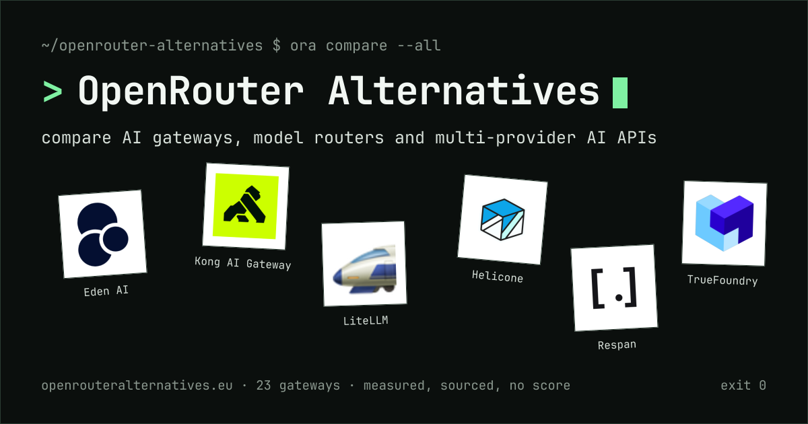

<p align="center">
  <a href="https://openrouteralternatives.eu">
    
  </a>
</p>

<h1 align="center">OpenRouter Alternatives</h1>

<p align="center">
  <strong>One table. 23 AI gateways. Every figure dated, sourced and labelled by how it was obtained.</strong><br>
  No score. No “best”. Jurisdiction and data residency recorded as separate facts, never inferred from each other.
</p>

<p align="center">
  <a href="https://openrouteralternatives.eu"></a>
  
  
  <a href="https://github.com/openrouteralternatives/openrouteralternatives-site/stargazers"></a>
</p>

<p align="center">
  <a href="https://openrouteralternatives.eu/#compare">Open the table</a> ·
  <a href="https://openrouteralternatives.eu/why">Why we built it</a> ·
  <a href="https://openrouteralternatives.eu/#methodology">Methodology</a> ·
  <a href="#add-or-correct-a-gateway">Contribute</a>
</p>

---

## Why this exists

We had to pick an AI gateway for a large European company whose one hard requirement was that the
operator must not be subject to the US CLOUD Act. Hosting in an EU region was not enough: the law
follows the company, not the server. The comparisons we found treated “EU company” and “EU hosted”
as the same thing, rarely named the legal entity behind a product, and ranked vendors by scores
whose ingredients were never stated.

So we did the research ourselves, with one rule applied to every vendor, and published it. The
full reasoning, including the US legal authorities involved and links to their primary texts, is
on [`/why`](https://openrouteralternatives.eu/why).

## What the table looks like

```
$ ora compare --jurisdiction eu

  gateway    country      eu residency     models                employees  openai  certifications
  ─────────  ───────────  ───────────────  ────────────────────  ─────────  ──────  ─────────────────────
  Eden AI    France       ● EU by default  1,000+  ○ official    11-50      ✓ yes   SOC 2 · ISO/IEC 27001
                                                   measured 638
  Opper AI   Sweden       ● EU by default  700+    ○ official    11-50      ✓ yes   — not recorded
  Cortecs    Austria      ● EU by default  150+    ○ official    2-10       ✓ yes   ISO/IEC 27001
                                                   measured 107
  EUrouter   Netherlands  ● EU by default  140+    ◇ catalogue   2-10       ✓ yes   — not recorded

  4/23 rows · a filtered view is ordered by model count, largest first
```

Ten columns: gateway, jurisdiction, EU residency, models, certifications, employees,
providers / routes, OpenAI compatibility, modalities, deployment with zero data retention.
Every row expands into the full record: legal entity, ownership, funding, observability,
pricing disclosure, gateway and inference locations, the complete model-count history, and
the sources with the date each was read.

## The rules the code enforces

| Rule | How it is kept |
| --- | --- |
| **Nothing is ranked.** | No composite score exists anywhere in the code. The table opens alphabetically; a filtered view is ordered by model count; every column sorts in one declared direction, with model count as the tiebreak. The gateway and jurisdiction columns do not sort at all. |
| **Rows without a value sink.** | `sortUndefined: "last"` on every sortable column, so an unmeasured catalogue can never reach the top. |
| **A blank is never a zero.** | Every value is a `Field<T>` carrying a status. A missing value renders its reason: *Not recorded*, *Not published*, *Not applicable*, *Configured by you*, *Different metric*. |
| **Evidence travels with the number.** | Quantities are `Metric` objects with dated observations. Under each figure: `●` measured by this project, `○` officially published, `◇` from an official catalogue, `—` not published. Measured and vendor-stated figures are never shown as the same kind of evidence. |
| **History is never overwritten.** | A new measurement is appended; superseded figures stay in the record, in the expanded row and in [`data/changelog.ts`](data/changelog.ts). |
| **Jurisdiction ≠ residency.** | Where the company is incorporated, where the gateway terminates requests and where inference runs are three fields from three sources. EU incorporation is never taken as evidence of EU processing. |

`npm run audit` fails the build on the structural parts: duplicate entities, a residency claim
without support, a route count recorded as a model count, a certification without a source, a
logo that does not exist, and more.

## Run it locally

Needs Node 20.9 or newer.

```bash
npm ci
npm run dev        # http://localhost:3000
```

```bash
npm run typecheck  # tsc --noEmit
npm run lint       # eslint
npm run audit      # dataset integrity + unresolved-field classification
npm test           # unit tests for the research scripts
npm run build      # production build; every route is static
```

The site is fully static: no database, no backend, no runtime data fetching. The one external
read is the repository's star count for the header button, fetched once at build time
(`GITHUB_TOKEN` is optional and only lifts GitHub's rate limit).

## Add or correct a gateway

Facts live in one place, [`data/gateways.ts`](data/gateways.ts). Everything else reads from it.

1. **Add an entry** with `createGateway({ ... })`. Write only the fields you can source;
   [`lib/create-gateway.ts`](lib/create-gateway.ts) fills the rest with `needs-verification`, so
   an unfilled field can never be mistaken for a researched one. Drop the vendor's mark in
   [`public/logos/`](public/logos/README.md) and list its origin.
2. **Record a measurement** as a dated observation rather than editing a number:

   ```ts
   models: metric(
     measured(1102, "2026-09-22", { scope: "llm", sourceIds: ["models-endpoint"] }),
     [measured(1038, "2026-09-15", { scope: "llm", sourceIds: ["models-endpoint"] })],
   ),
   ```

3. **Log it** in [`data/changelog.ts`](data/changelog.ts) with the previous value, the new one
   and the source.
4. **Run `npm run audit`** and open a pull request.

Accepted as evidence: a public endpoint, a registry filing, the vendor's legal pages, product
documentation. Never accepted: a competitor's comparison page, in either direction.

<details>
<summary><strong>Dataset conventions worth knowing</strong></summary>

- **Models, providers, routes and endpoints are four quantities.** A route is one model served
  by one provider; an endpoint is an addressable API entry as the vendor defines it. Portkey's
  published 1,600+ counts endpoints, so its model count reads *Different metric*. Routes and
  endpoints share the “Providers / routes” column beneath the provider count, labelled.
- **Vendor floors stay floors.** “500+” is stored with the plus sign and sorts on 500. Where a
  floor and a measurement both exist, both are shown.
- **Customer-configured gateways publish no catalogue count.** Where the software documents how
  many integrations it ships, that number is shown and labelled *Integrations*, never compared
  with a hosted catalogue.
- **`openaiCompatible`** is read from documentation only, shown as yes / partial / no / unknown,
  and never used to order anything. A record not yet checked keeps `value: null`.
- **`funding`** is the number of disclosed rounds and the named investors, describing the
  operating company. Unverifiable funding is *Not publicly listed*, never zero; a hyperscaler
  product records *Not applicable*.
- **`observability`** is one of five documented levels, never a score.
- **Employees** are LinkedIn size bands. Follower counts are snapshots, shown in the expanded
  row only, and never used to order anything.
- **Sorting is semantic and single-direction:** counts on their numeric value, employees on the
  band's lower bound, deployment on the number of documented options, residency and OpenAI
  compatibility on the orders declared in [`lib/taxonomy.ts`](lib/taxonomy.ts).

</details>

## How the data is gathered

[`scripts/firecrawl/`](scripts/firecrawl/README.md) collects each gateway's public pages through
the Firecrawl API and extracts structured *candidates* with verbatim evidence and source URLs.
[`scripts/measure/`](scripts/measure) enumerates public model endpoints with the counting rule
(duplicates, provider prefixes, routing variants and pseudo-entries removed). Neither touches
`data/gateways.ts`: a person verifies every candidate against its cited page before it is
recorded.

```bash
npm run firecrawl:targets   # list the URLs that would be collected, no API call
npm run firecrawl:discover  # find pricing, legal, docs and security pages the dataset does not cite
npm run firecrawl:extract   # Markdown + schema-guided candidates per gateway
npm run firecrawl:diff      # candidates vs dataset, field by field, no API call
npm run measure:models      # enumerate public model endpoints into research/measurements
```

## The look

A terminal. One monospace face (JetBrains Mono), square corners, no shadows, hairline and
dashed rules; a shell prompt for a wordmark, bracketed navigation, command-line flags for the
filters, and status glyphs instead of icons. Two palettes share that grammar and the theme
toggle switches them: paper and ink with a deep green accent, and a phosphor display. All
tokens live in [`app/globals.css`](app/globals.css).

The link preview card at the top of this page is rendered at build time by
[`app/opengraph-image.tsx`](app/opengraph-image.tsx) from six marks in `public/logos`, and
served as `og:image` and `twitter:image`. A 1280×640 copy for GitHub's repository **Social
preview** setting is kept at [`docs/social-card-github.png`](docs/social-card-github.png).

## Layout

```
app/            routes (static): page.tsx, why/, opengraph-image.tsx, twitter-image.tsx, sitemap, robots
components/     comparison table, cells, filters, expanded row, mobile cards; hero, methodology, contribute; header, footer
data/           the only place facts live: gateways.ts, sources.ts, why.ts, changelog.ts, site.ts
lib/            filtering, metrics, formatting, taxonomy, table config, SEO, the social card
scripts/        audit-dataset.ts, firecrawl/, measure/, and their unit tests
research/       Firecrawl output and dated model-endpoint enumerations
public/logos/   locally stored gateway marks with a provenance table
content/        editorial rules and open research items
```

Routes from earlier revisions (`/compare`, `/gateways`, `/categories`, `/blog`) redirect
permanently to the homepage.

## Accessibility

Status is never conveyed by colour alone: every glyph has a word next to it and every icon-only
control has an accessible label. All text colours clear 4.5:1 on their ground in both palettes.
The table uses `aria-sort`, `aria-expanded`, a sticky header and first column, and becomes one
card per gateway below the large breakpoint. Methodology details are native disclosure elements
and need no JavaScript.
